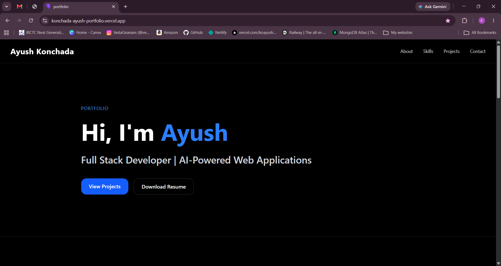
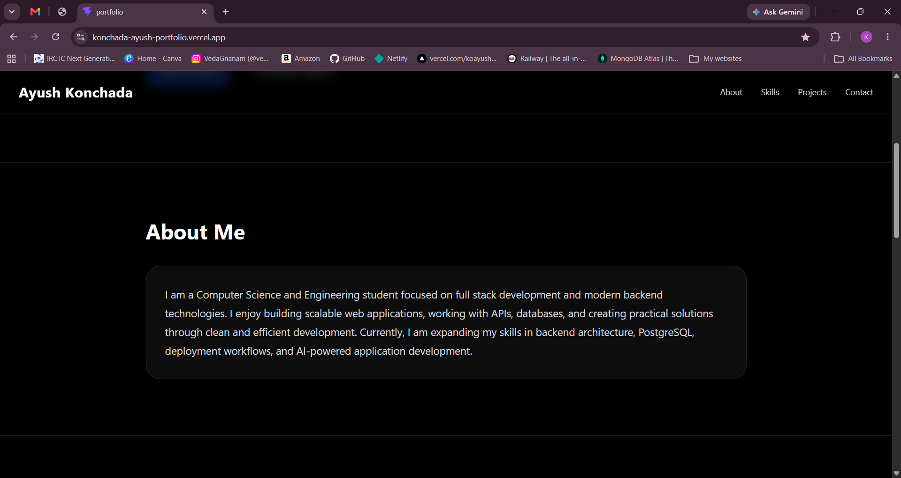
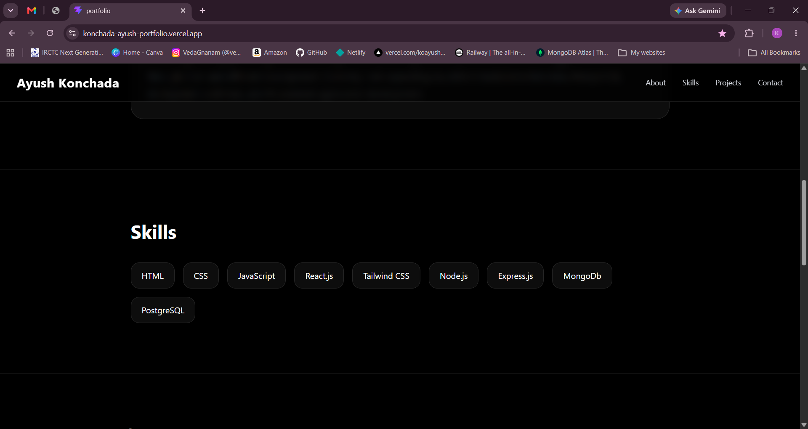
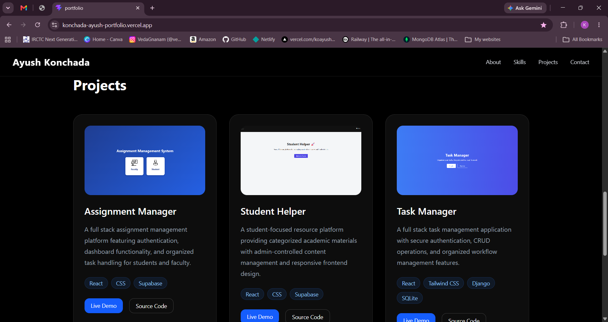
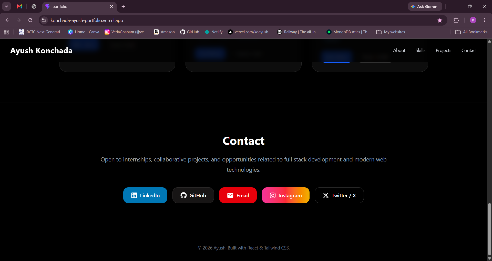

# 🚀 Ayush Portfolio

A modern, responsive, and interactive portfolio website showcasing my projects, skills, and experience as a Full Stack Developer.

🌐 **Live Website:** https://konchada-ayush-portfolio.vercel.app

---

## 📸 Preview

### Home



### About



### Skills



### Projects



### Contact



---

## ✨ Features

* Modern Dark Theme UI
* Fully Responsive Design
* Mobile Navigation Menu
* Smooth Scrolling Navigation
* Project Showcase
* Resume Download
* Social Media Integration
* Live Demo Links
* GitHub Repository Links
* Professional Contact Section
* Fast Loading Performance

---

## 🛠️ Tech Stack

### Frontend

* React
* TypeScript
* Tailwind CSS
* Vite

### Deployment

* Vercel

### Icons

* React Icons

### Version Control

* Git
* GitHub

---

## 📂 Folder Structure

```text
portfolio/
│
├── public/
│   ├── assignment-manager.png
│   ├── student-helper.png
│   ├── task-manager.png
│   ├── Ayush_Konchada_Resume.pdf
│   ├── favicon.svg
│   │
│   └── screenshots/
│       ├── home.png
│       ├── about.png
│       ├── skills.png
│       ├── projects.png
│       └── contact.png
│
├── src/
│   ├── assets/
│   ├── App.tsx
│   ├── App.css
│   ├── index.css
│   └── main.tsx
│
├── .gitignore
├── package.json
├── package-lock.json
├── tsconfig.json
├── tsconfig.app.json
├── tsconfig.node.json
├── vite.config.ts
└── README.md
```

---

## 🚀 Featured Projects

### 📋 Assignment Manager

A full-stack assignment management platform featuring authentication, dashboard functionality, and organized task handling for students and faculty.

#### Technologies Used

* React
* CSS
* Supabase

#### Features

* User Authentication
* Dashboard Interface
* Assignment Tracking
* Responsive Design

---

### 🎓 Student Helper

A student-focused platform providing categorized academic resources with admin-controlled content management.

#### Technologies Used

* React
* CSS
* Supabase

#### Features

* Categorized Resources
* Admin Panel
* Responsive UI
* Easy Navigation

---

### ✅ Task Manager

A task management application with authentication and CRUD operations for efficient workflow management.

#### Technologies Used

* React
* Tailwind CSS
* Django
* SQLite

#### Features

* Authentication
* Create Tasks
* Update Tasks
* Delete Tasks
* Responsive Design

---

## 🧑‍💻 About Me

I am a Computer Science and Engineering student focused on Full Stack Development and modern backend technologies.

I enjoy building scalable web applications, working with APIs, databases, deployment workflows, and exploring AI-powered web solutions.

---

## 📧 Contact

### LinkedIn

https://www.linkedin.com/in/ayush-konchada-008721310

### GitHub

https://github.com/koayush1310

### Email

mailto:konchadaayush123@gmail.com

### Instagram

https://instagram.com/k.ayush_13

### Twitter / X

https://x.com/AyushKonch28299

---

## ⚙️ Installation

Clone the repository:

```bash
git clone https://github.com/koayush1310/ayush-portfolio.git
```

Move into the project folder:

```bash
cd ayush-portfolio
```

Install dependencies:

```bash
npm install
```

Run development server:

```bash
npm run dev
```

---

## 🏗️ Build For Production

```bash
npm run build
```

Preview production build:

```bash
npm run preview
```

---

## 🌐 Deployment

This project is deployed using Vercel.

### Deployment Steps

1. Push code to GitHub
2. Import repository into Vercel
3. Configure project settings (if needed)
4. Deploy
5. Get live URL

---

## 📈 Future Improvements

* Framer Motion Animations
* Blog Section
* Experience Timeline
* Skills Progress Indicators
* GitHub Statistics
* Project Filtering
* Light/Dark Theme Toggle
* Project Search Functionality
* Contact Form Integration

---

## 📄 Resume

Resume can be downloaded directly from the portfolio website using the **Download Resume** button.

---

## © License

This project is open-source and available under the MIT License.

---

### Built with ❤️ by Ayush Konchada